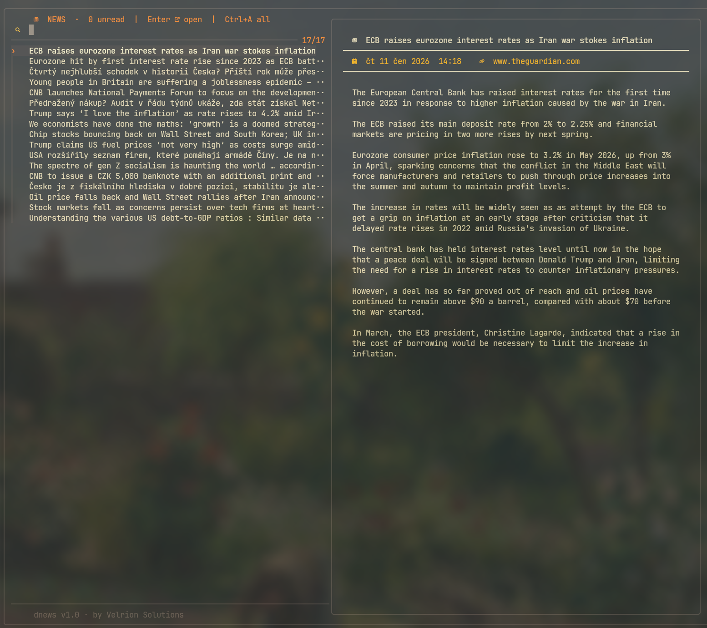

# dnews

> A fast, minimal terminal news reader with Reader View — built for people who want to stay informed without leaving the terminal.



---

## Overview

**dnews** combines [newsboat](https://newsboat.org/) for feed fetching with [fzf](https://github.com/junegunn/fzf) for a clean interactive UI. Articles are rendered via [rdrview](https://github.com/eafer/rdrview) — the same Reader View technology as Firefox — stripped of ads, navigation and clutter.

Two screens, nothing else: a dense list of every article, and — on `Enter` — the full article in Reader View. Feeds reload once on launch with a live progress bar. Read articles stay in the list but fade to gray instead of disappearing. Everything stays in your terminal.

---

## Features

- Minimal two-line list rows (title + source/time), Gruvbox color theme with Nerd Font icons
- `Enter` opens the full article in Reader View via rdrview, marking it read on open
- Category tabs (`F1`-`F9`) to filter the list down to one feed group — All, or whatever categories
  your `feeds.opml` groups feeds into
- Exact word search across all headlines
- Feed-count progress bar on reload, driven straight off newsboat's own log
- Feed list managed as OPML (`feeds.opml`) — re-run `./install.sh` to apply changes
- Full UTF-8 support including diacritics
- No preview pane, no background/cron refresh — feeds reload once at launch (or on demand with `Ctrl+R`)

---

## Dependencies

| Package | Purpose | Install |
|---------|---------|---------|
| `newsboat` | RSS feed fetcher | `pacman -S newsboat` |
| `fzf` | Interactive UI | `pacman -S fzf` |
| `sqlite3` | Database queries | `pacman -S sqlite` |
| `rdrview` | Reader View | `yay -S rdrview` |
| `pandoc` | HTML → plain text | `pacman -S pandoc` |
| `less` | Article pager | `pacman -S less` |
| `python-ftfy` | Encoding fixes | `pip install ftfy` |

---

## Install

```bash
git clone https://github.com/ret3030/dnews
cd dnews
./install.sh
```

Edit `feeds.opml` with your feeds before installing (or after — just re-run `./install.sh`); it replaces
whatever is in `~/.config/newsboat/urls`. Alternatively, edit `urls` directly — see `urls.example` for
the manual format.

---

## Usage

```bash
dnews
```

| Key | Action |
|-----|--------|
| `Enter` | Open the article in full-screen Reader View (marks it read); `q` to return to the list |
| `F1` | Show all articles |
| `F2`-`F9` | Filter to one feed category (from `feeds.opml`, in order) |
| `Ctrl+R` | Force reload feeds from network |
| `/` | Search headlines |
| `Esc` | Clear search (stays on the current tab) |
| `j` / `k` | Navigate up / down |
| `d` / `u` | Page down / up |

Category tabs come straight from the top-level groups in `feeds.opml` (the OPML `<outline>` folders,
e.g. "Zprávy & Trhy", "Tech & Dev") — no separate config needed. Up to 8 categories get a tab
(`F2`-`F9`); the active tab is highlighted in the header.

---

## Built by

[Velrion Solutions](https://github.com/ret3030)
