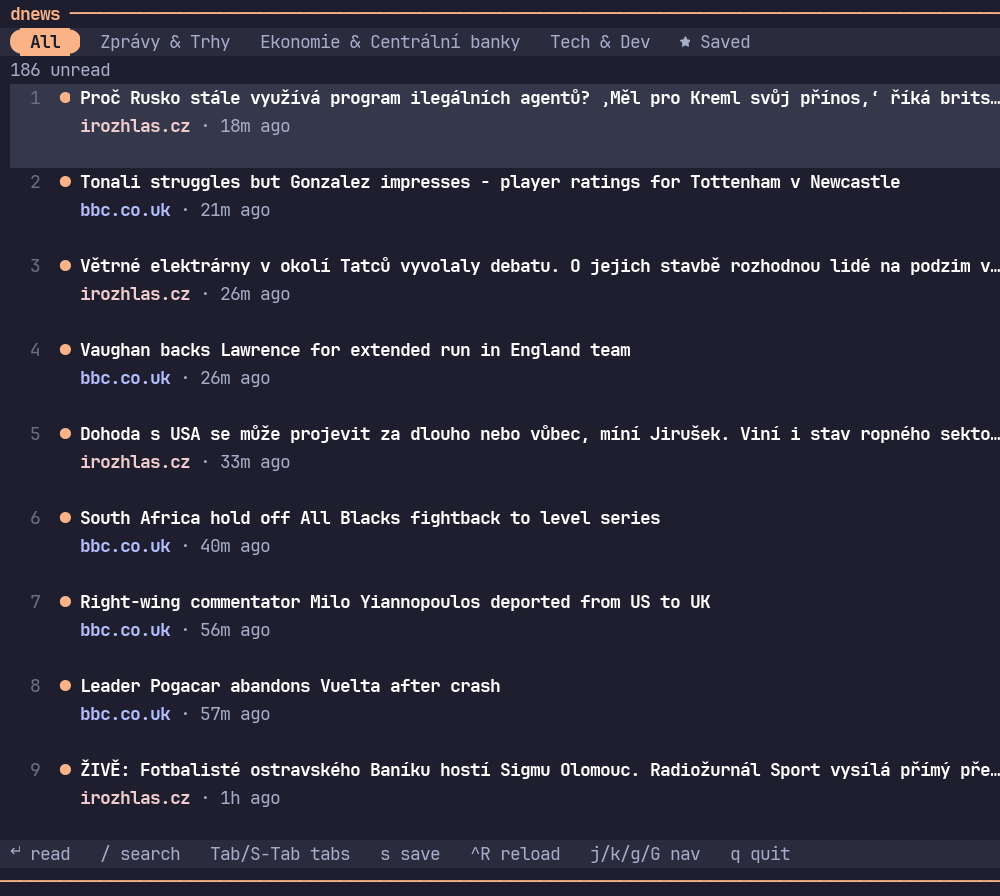

# dnews

> A fast, minimal terminal news reader with Reader View — one native binary, no subprocess glue.



## Overview

**dnews** is a single Rust binary: it fetches your RSS/Atom feeds concurrently, stores them in its
own SQLite database, and renders a [ratatui](https://ratatui.rs) terminal UI — a dense article list,
and the full article extracted with a Rust port of Mozilla's Readability (the same engine behind
Firefox's Reader Mode). On a wide terminal the article view sits in a side panel next to the list; on
a narrower one it opens full-screen instead.

There's no newsboat, no fzf, no rdrview/pandoc pipeline, no `less` handoff — everything runs inside
one process, so reloading is genuinely concurrent (every feed fetched in parallel, not one at a time)
and the UI never blocks or shells out.

---

## Features

- Wide terminals split into a list + article panel side by side; narrower ones use a full-screen
  reader instead — see Usage below for how keyboard focus moves between list and article
- Article text preserves real paragraph breaks and flags where images were with a `[image: alt]`
  marker (inline image rendering isn't possible in a plain terminal buffer); article text is cached
  in SQLite so reopening it later doesn't refetch
- Save articles for later (`s`) — a dedicated "Saved" tab collects them regardless of category, and
  saved articles are never auto-deleted
- Unsaved articles older than two months are pruned automatically so the list doesn't grow forever;
  a rolling backup of the database is kept as a safety net against a future migration bug, not against
  ordinary app updates (which never touch the database at all)
- Responsive to narrow terminals: the tab bar, footer hints, search box, and progress bar all adapt
  instead of clipping or misaligning
- Rounded pill-style category tabs, cycled with `Tab`/`Shift+Tab`, driven by `feeds.opml`'s folder
  structure — no separate config
- Live, non-blocking reload: feeds fetch concurrently in the background, animated progress bar
- Full vim-style navigation (`j`/`k`, `g`/`G`, `d`/`u`)
- Modern dark theme (Catppuccin Mocha–inspired, no pure-black background)
- Search (`/`) filters the list live as you type

---

## Install

Requires the [Rust toolchain](https://rustup.rs) (`cargo`/`rustc`).

```bash
git clone https://github.com/ret3030/dnews
cd dnews
./install.sh
```

This builds a release binary and installs it to `~/.local/bin/dnews`, and copies `feeds.opml` to
`~/.config/dnews/feeds.opml` if you don't already have a local one.

Edit `feeds.opml` to change your feeds — top-level `<outline>` folders become category tabs. Running
`dnews` from a directory containing `feeds.opml` uses that file; otherwise it falls back to
`~/.config/dnews/feeds.opml`.

---

## Usage

```bash
dnews
```

### Narrow terminal

| Key | Action |
|-----|--------|
| `Enter` | Open the selected article full-screen (marks it read) |
| `q` / `Esc` | Back to the list (from the article) / quit (from the list) |
| `Shift+J` / `Shift+K` (in the article) | Jump to the next / previous article without leaving the reader |

### Wide terminal (split list + article panel)

Keyboard focus toggles between the list and the panel — it never switches just from moving the
selection:

| Key | Action |
|-----|--------|
| `Enter` | Load the selection into the panel, mark it read, and focus it — plain vim keys now scroll the article |
| `q` / `Esc` (while the panel is focused) | Unfocus back to the list; the panel clears |
| `q` (while the list is focused) | Quit |
| `Shift+J` / `Shift+K` | Move the list selection and live-preview it in the panel, without changing which pane plain keys control |

### Both layouts

| Key | Action |
|-----|--------|
| `Tab` / `Shift+Tab` | Next / previous tab (All → categories → Saved) |
| `s` | Save / unsave the currently relevant article |
| `Ctrl+R` | Reload feeds (non-blocking, runs in the background) |
| `/` | Search headlines live |
| `j`/`k`, arrows | Move down / up |
| `g` / `G` | Jump to top / bottom |
| `d`/`u`, PageDown/Up | Page down / up |

---

## Built by

[Velrion Solutions](https://github.com/ret3030)
